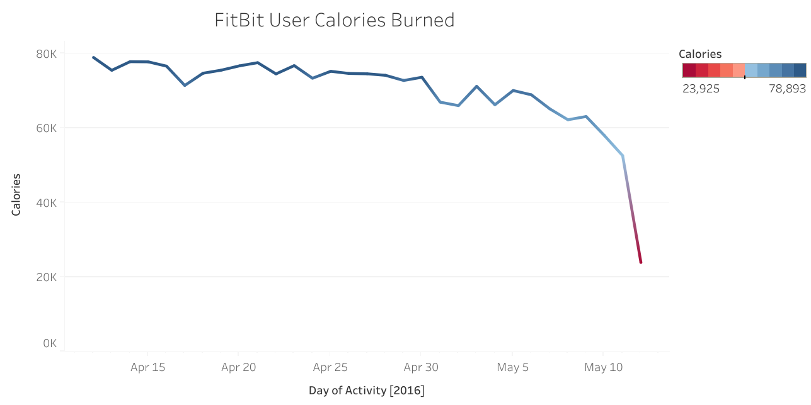
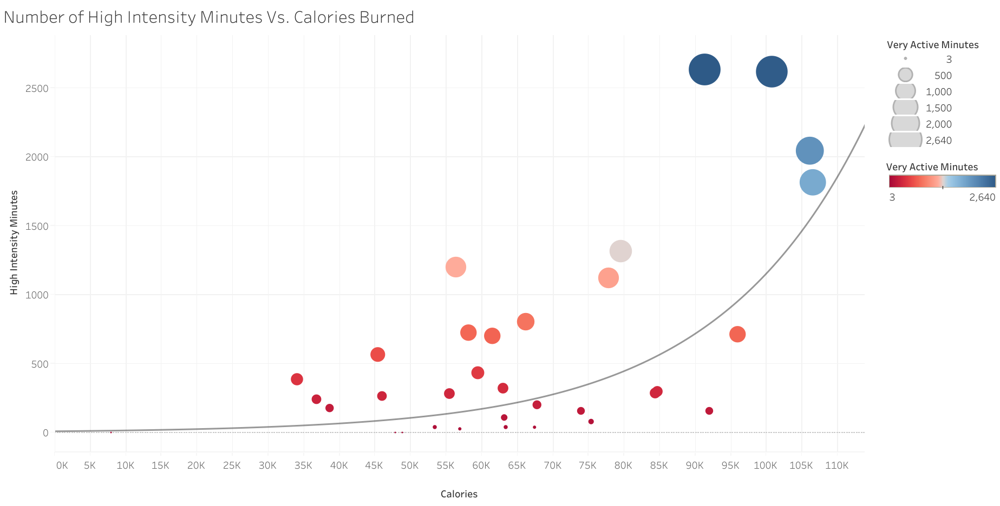

```{r setup, include=FALSE}
knitr::opts_chunk$set(echo = TRUE)
```

## Executive Summary

- [Bellabeat](https://bellabeat.com/) is a health-focused tech company focused on improving the well-being of women through use of their smart devices. By collecting activity data, Bellabeat is able to provide health and habits data to their customers. <br>
   
- Bellabeat has offices worldwide and offer multiple smart-device products, including: <br><br>
 
     - **Bellabeat App** - *provides health data on activity, sleep, stress, menstrual cycle, and mindfulness habits.*<br><br>
     
     - **Leaf** - *wellness tracker, connects to app to track health data.*<br><br>
     
     - **Time** - *wellness tracker with the appearance of a "classic" wristwatch. Connects to app to track health data.*<br><br>
     
     - **Spring** - *smart water bottle that tracks daily water intake. Connects to app to track hydration*.<br><br>
    
  - Provided with consumer smart device usage data, the Bellabeat marketing team is looking for the following:<br><br>
  - Trends in consumer smart device usage,<br><br>
  - Ways that Bellabeat can apply the trend data to improve the customer experience,<br><br>
  - Ways to use the trend data to influence Bellabeat marketing strategy.


## Data Sources Used

[FitBit Fitness Tracking Data on Kaggle](https://www.kaggle.com/datasets/arashnic/fitbit)<br><br>
 [Bellabeat Product Website](https://bellabeat.com/catalog/)
 
## Data Cleaning Process

The first step I took when analyzing the collected data was to compare which features were unique to each device, and then determine what features were missing from the Bellabeat app. The below table shows the results of that comparison:
<br>


| Tracked Data | FitBit | Bellabeat |
| :- | :-: | :-: |
| Daily Activity | Yes | Yes
| Calories | Yes | No
| Intensities | Yes | No
| Steps | Yes | Yes
|Heart Rate | Yes | Yes
| Sleep | Yes | Yes
| Weight | Yes | No
| Cycle | No | Yes
<br>


From here, I wanted to look at the FitBit data to see how consumers were using the features available. Using R, I imported the data files to inspect the data and determine if there were any errors.

```{r Install tidyverse, eval=FALSE, include=FALSE}
# Install "tidyverse" for data analysis

install.packages("tidyverse")

```


```{r Load tidyverse library}
# Load "tidyverse" library

library(tidyverse)

```

```{r Import datasets}
# Import FitBit datasets

fit_activity <- read_csv('dailyActivity_merged.csv', show_col_types = FALSE) %>% 
    select(-"Calories")
fit_calories <- read_csv("dailyCalories_merged.csv", show_col_types = FALSE)
fit_intensity <- read_csv("dailyIntensities_merged.csv", show_col_types = FALSE)
fit_steps <- read_csv("dailySteps_merged.csv", show_col_types = FALSE)
fit_heart <- read_csv("heartrate_seconds_merged.csv", show_col_types = FALSE)
fit_sleep <- read_csv("sleepDay_merged.csv", show_col_types = FALSE)
fit_weight <- read_csv("weightLogInfo_merged.csv", show_col_types = FALSE)
```

```{r Merge tables}
# Merge common columns into one dataset by matching "Id" column

fit_join <- merge(x = fit_activity, y = fit_calories, by = "Id")
fit_join <- merge(x = fit_activity, y = fit_intensity, by = "Id")
fit_join <- merge(x = fit_activity, y = fit_weight, by = "Id")

# Used 'head()' function to preview the combined dataset

head(fit_join)
```


## Summary of Analysis

When looking at the FitBit datasets, I noticed that a majority of the tracked data points were also represented by Bellabeat products. The data that the Bellabeat app did not provide were the calories burned, activity intensities at various time intervals, and weight. It is not clear from the available data whether Bellabeat is missing out on potential customers from the lack of these features.<br>

An interesting observation that came up is the decline of user's calories burned from the beginning of the tracked dates until the end of the dates. <br>

<br>
Looking at this plotted data, we can see how the overall daily calories burned decreases as the month goes on. This could be the result of diminishing interest among participants as data recording went on, or this could be from a lack of a scheduled reminders to exercise from their fitness tracking app.

Recommendation 1: 
Bellabeat should begin tracking calories burned and focus on consistent activity reminders in order to encourage user participation in healthy activities.

According to a 2015 study on workout intensity [-@cal], high-intensity exercise directly relates to more calories burned, as opposed to low-intensity exercise, and of course, sedentary lifestyles. This conclusion can be seen in the FitBit 30-day fitness data by comparing exercise intensity with calories burned.


Recommendation 2:
Bellabeat should encourage and/or recommend High-Intensity exercise for users seeking to eliminate more calories in their daily activities. Adding the capability for the Bellabeat app to track exercise intensity could be beneficial to many in their user base.

## Review Based On Analysis

Based on the trends identified in my analysis, I recommend the following:

 - Calorie tracking should be added as a feature to the Bellabeat app, where the metrics from user devices can be calculated into useful data. Calorie tracking is a common feature in various other smart devices and may entice new customers to try Bellabeat products in the future.
 
 - Exercise intensity levels should be tracked along with the current data collected during an exercise regimen. Varying the intensity of their workouts based on preset goals for calorie/weight loss can benefit Bellabeat customer health, and appeal to a larger audience.  
 
## Wrapup

Today we discussed different methods for the Bellabeat marketing team to enhance the Bellabeat app for their users. 

 - We looked at the current range of Bellabeat products and the benefits they offered to the customer base.
 
 - Next, we identified competitor smart device data sets and began the cleaning process for the pertinent data.
 
 - We then compared the features available from FitBit Fitness data to that of the Bellabeat line, identifying potential missed opportunities to improve Bellabeat products.
 
 - Using Tableau to create data visualizations, we looked at the trend of user's calories burned throughout the 30-day study, and noticed a decline in progress as the study went on. This led to the recommendation for Bellabeat to track calories and implement a consistent method of reminding users to exercise.
 
 - Again, we used Tableau to create a visualization showing how higher intensity exercise can dramatically increase the amount of calories burned in a workout. This led to the recommendation that Bellabeat should show various intensity exercises that may have a bigger impact on desired calorie burn/weight loss.
 
 Thank you for time and I hope this analysis is beneficial to the improvement of the Bellabeat app!
 
## References <br>